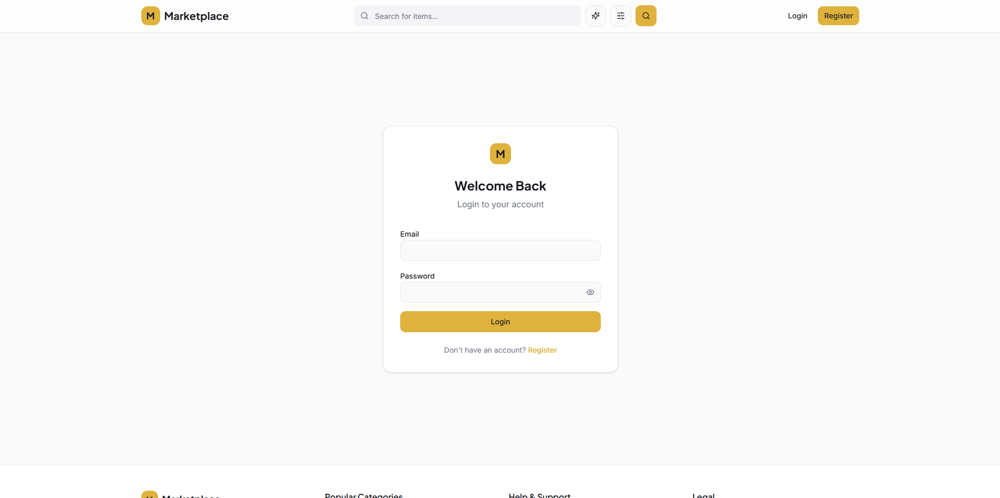
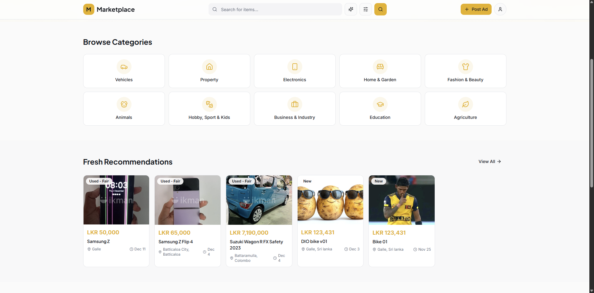
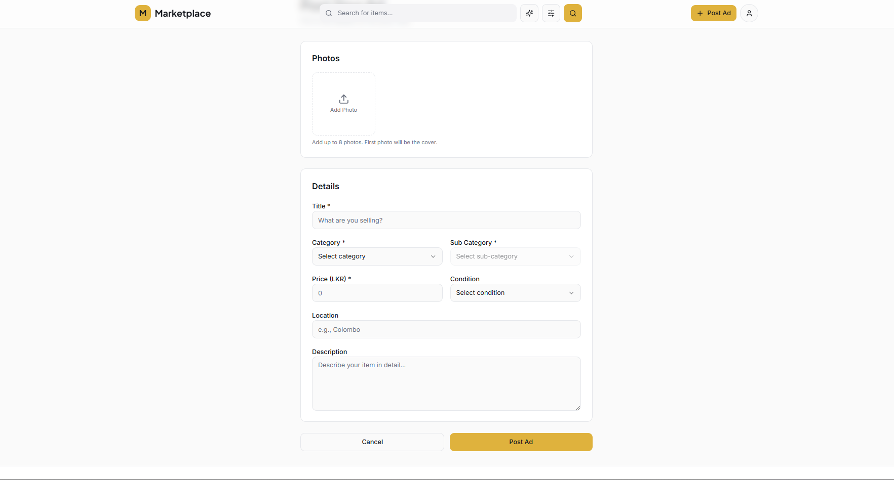
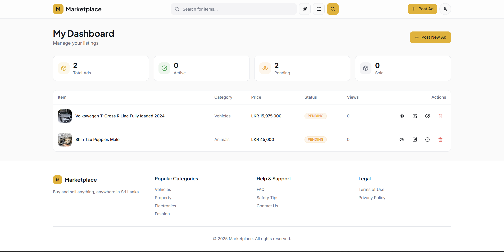
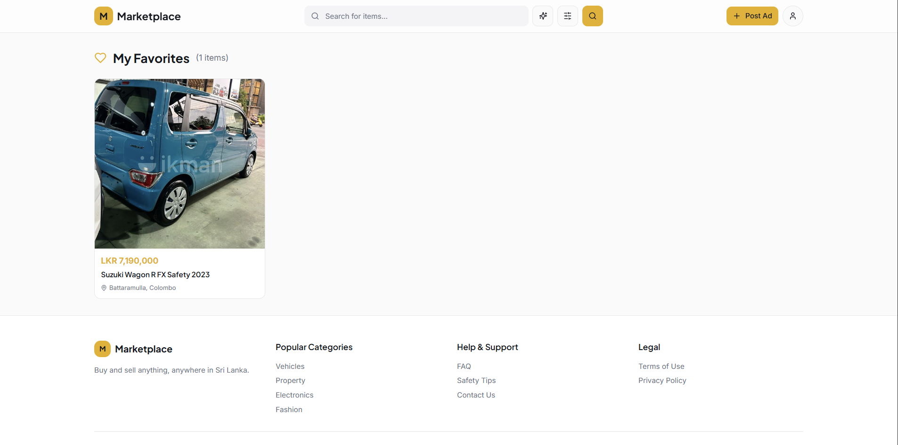
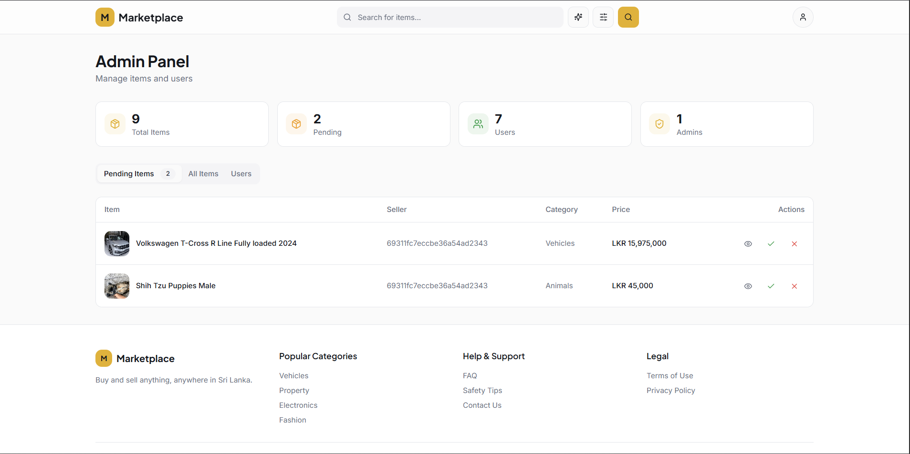
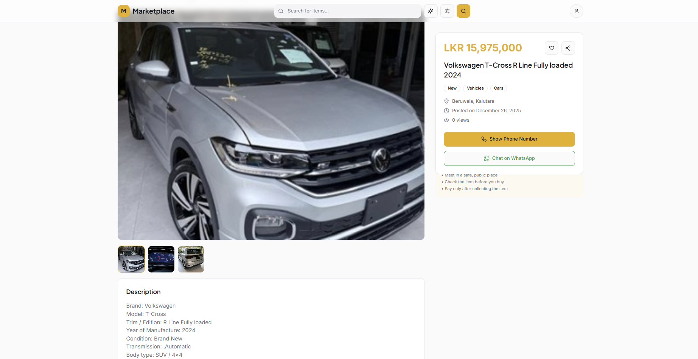

# Lanka Marketplace 🛒

A modern, full-featured online marketplace platform for buying and selling items in Sri Lanka. Built with React, TypeScript, and a comprehensive backend API.

## 📋 Project Description

Lanka Marketplace is Sri Lanka's premier online classifieds platform where users can buy and sell a wide variety of items including vehicles, property, electronics, home & garden items, fashion products, and more. The platform features user authentication, item management, favorites, admin controls, and AI-powered search capabilities.

### Key Highlights
- **Multi-category marketplace** with 10+ main categories and 50+ subcategories
- **User authentication** with role-based access control (User/Admin)
- **Item management** with approval workflow
- **AI-powered search** for intelligent item discovery
- **Favorites system** for saving items
- **Responsive design** optimized for mobile and desktop
- **Admin dashboard** for platform management

## 🚀 Technologies and Tools Used

### Frontend
- **React 18.3.1** - Modern UI library
- **TypeScript 5.8.3** - Type-safe JavaScript
- **Vite 5.4.19** - Fast build tool and dev server
- **React Router DOM 6.30.1** - Client-side routing
- **TanStack Query 5.83.0** - Server state management
- **Tailwind CSS 3.4.17** - Utility-first CSS framework
- **shadcn/ui** - High-quality React components built on Radix UI
- **Radix UI** - Accessible component primitives
- **React Hook Form 7.61.1** - Form validation and management
- **Zod 3.25.76** - Schema validation
- **Lucide React** - Beautiful icon library
- **date-fns** - Date utility library
- **Recharts** - Charting library
- **Sonner** - Toast notifications

### Development Tools
- **ESLint** - Code linting
- **TypeScript ESLint** - TypeScript-specific linting
- **Autoprefixer** - CSS vendor prefixing
- **PostCSS** - CSS processing
- **SWC** - Fast JavaScript/TypeScript compiler

## 📦 Setup and Run Instructions

### Prerequisites
- **Node.js** (v18 or higher) - [Install with nvm](https://github.com/nvm-sh/nvm#installing-and-updating)
- **npm** or **yarn** package manager
- **MongoDB** instance (local or cloud)

### Frontend Setup

1. **Clone the repository**
   ```bash
   git clone https://github.com/AshenIndeewara/marketplace
   cd marketplace
   ```

2. **Install dependencies**
   ```bash
   npm install
   ```

3. **Configure environment**
   
   The frontend connects to the backend API at `http://localhost:5000/api/v1` by default. If your backend runs on a different URL, update the `API_BASE_URL` in `src/service/api.ts`.

4. **Start the development server**
   ```bash
   npm run dev
   ```
   
   The application will be available at `http://localhost:5173` (or the next available port).

5. **Build for production**
   ```bash
   npm run build
   ```
   
   The production build will be created in the `dist` folder.

6. **Preview production build**
   ```bash
   npm run preview
   ```


### Backend
- **API Base URL**: `https://api.marketplace.lk/api/v1`

## ✨ Main Features

### 1. **User Authentication & Authorization**
- User registration
- Secure login with JWT tokens
- Role-based access control (User/Admin)
- Password encryption and secure storage
- Automatic token refresh



### 2. **Browse & Search Items**
- Browse items by 10+ main categories
- Filter by subcategories, price range, and more
- AI-powered intelligent search
- Real-time search suggestions
- Advanced filtering options



### 3. **Item Management**
- Post new items with multiple images
- Edit existing listings
- Delete items
- Mark items as sold
- Item approval workflow (Admin)
- Status tracking (Pending/Approved/Rejected/Sold)



### 4. **User Dashboard**
- View all your posted items
- Track item status
- Quick edit and delete actions
- Performance analytics
- Favorites management



### 5. **Favorites System**
- Save favorite items for later
- Quick access to saved items
- Remove from favorites
- Personalized recommendations



### 6. **Admin Panel**
- Manage all items (approve/reject/delete)
- User management
- Promote users to admin
- Platform statistics
- Content moderation



### 7. **Item Details**
- High-quality image gallery
- Detailed item information
- Seller contact details
- Related items suggestions
- Share functionality



### 8. **Responsive Design**
- Mobile-first approach
- Optimized for all screen sizes
- Touch-friendly interface
- Fast loading times
- Progressive Web App (PWA) ready

## 📁 Project Structure

```
lanka-marketplace/
├── src/
│   ├── components/        # Reusable UI components
│   │   ├── layout/       # Layout components (Header, Footer, etc.)
│   │   ├── items/        # Item-related components
│   │   └── ui/           # shadcn/ui components
│   ├── contexts/         # React contexts (Auth, etc.)
│   ├── hooks/            # Custom React hooks
│   ├── pages/            # Page components
│   │   ├── Index.tsx     # Home page
│   │   ├── Auth.tsx      # Login/Register
│   │   ├── Dashboard.tsx # User dashboard
│   │   ├── Admin.tsx     # Admin panel
│   │   ├── PostItem.tsx  # Create listing
│   │   ├── EditItem.tsx  # Edit listing
│   │   ├── ItemDetail.tsx # Item details
│   │   ├── Category.tsx  # Category browse
│   │   ├── Search.tsx    # Search results
│   │   └── Favorites.tsx # Saved items
│   ├── service/          # API service layer
│   │   └── api.ts        # API endpoints
│   ├── App.tsx           # Main app component
│   ├── main.tsx          # Entry point
│   └── index.css         # Global styles
├── public/               # Static assets
├── components.json       # shadcn/ui config
├── tailwind.config.ts    # Tailwind configuration
├── vite.config.ts        # Vite configuration
├── tsconfig.json         # TypeScript configuration
└── package.json          # Dependencies
```

## 🎨 Categories

The platform supports the following categories:

1. **Vehicles** - Cars, Motorbikes, Three Wheelers, Bicycles, Vans, Buses & Lorries, Heavy Machinery, Auto Parts
2. **Property** - Land, Houses For Sale, House Rentals, Apartments, Commercial Property
3. **Electronics** - Mobile Phones, Computers & Tablets, TVs, Cameras, Audio & MP3, Video Games
4. **Home & Garden** - Furniture, Home Appliances, Garden, Home Decor, Kitchen Items
5. **Fashion & Beauty** - Clothing, Shoes, Jewelry, Watches, Beauty Products
6. **Animals** - Pets, Pet Food, Farm Animals
7. **Hobby, Sport & Kids** - Musical Instruments, Sports & Fitness, Children's Items, Books
8. **Business & Industry** - Services, Equipment, Office Supplies
9. **Education** - Higher Education, Textbooks, Tuition
10. **Agriculture** - Food, Crops, Seeds & Plants

## 🔒 Security Features

- JWT-based authentication with access and refresh tokens
- Password hashing with bcrypt
- Protected API routes
- Role-based authorization
- XSS protection
- CORS configuration
- Input validation and sanitization

## 🛠️ Available Scripts

### Frontend

```bash
npm run dev          # Start development server
npm run build        # Build for production
npm run build:dev    # Build for development
npm run preview      # Preview production build
npm run lint         # Run ESLint
```

### Backend

```bash
npm run dev          # Start development server with nodemon
npm start            # Start production server
npm run lint         # Run ESLint
npm test             # Run tests
```

## 🤝 Contributing

Contributions are welcome! Please follow these steps:

1. Fork the repository
2. Create a feature branch (`git checkout -b feature/AmazingFeature`)
3. Commit your changes (`git commit -m 'Add some AmazingFeature'`)
4. Push to the branch (`git push origin feature/AmazingFeature`)
5. Open a Pull Request


## 👥 Authors

- **Ashen Indeewara** - Initial work

## 🙏 Acknowledgments

- [shadcn/ui](https://ui.shadcn.com/) for the beautiful component library
- [Radix UI](https://www.radix-ui.com/) for accessible primitives
- [Tailwind CSS](https://tailwindcss.com/) for the utility-first CSS framework

## 📧 Contact & Support

For support, create an issue in the repository.

---

**Made with ❤️ for IJSE**
